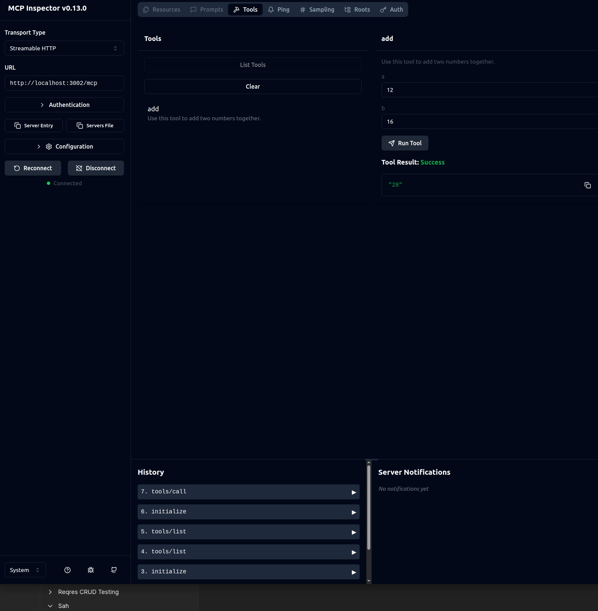
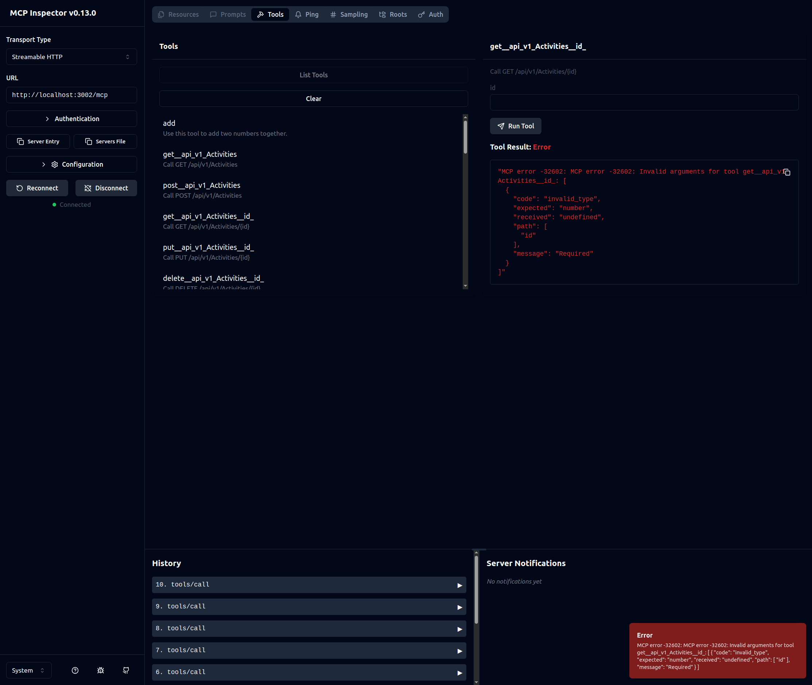
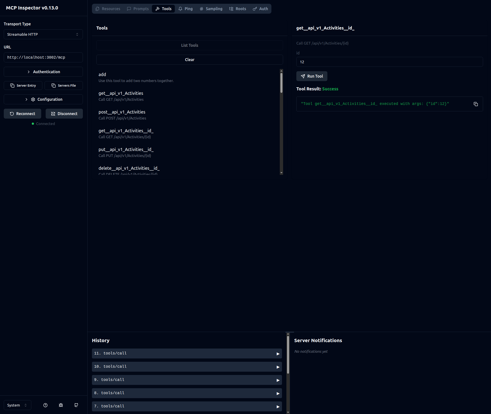

# mcp-md-tools
MCP Server to access MD Tools

This is a very bare bones implementation of an MCP server with StreamableHttp for http access.

## Samples

**Validation errors on submit**

**Submit with valid payload**

